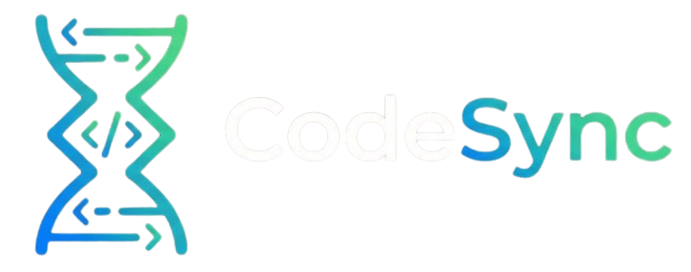
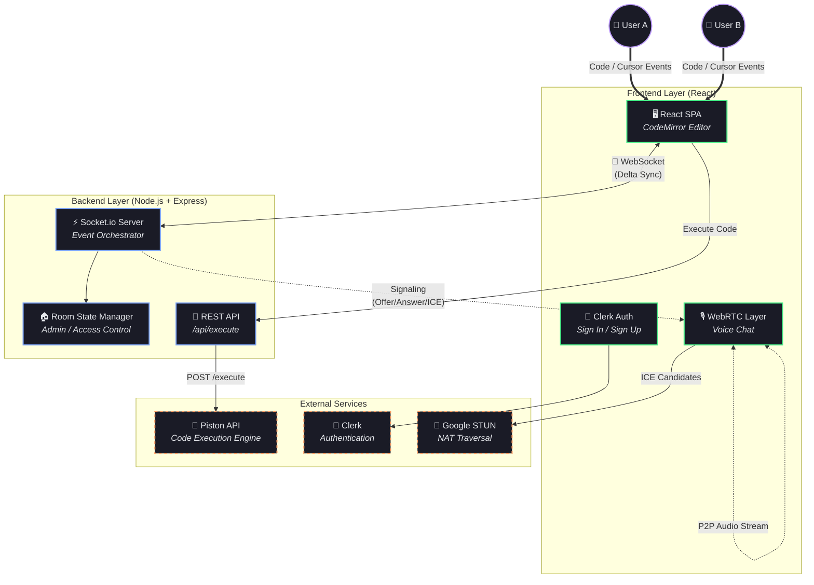

# ⚡ CodeSync

### Real-Time Collaborative Code Editor with Voice Communication

<!-- Banner Image — Replace the path below with your hosted banner URL -->
<!--  -->

<p align="center">
  
</p>

<p align="center">
  <strong>Code. Create. Collaborate.</strong><br/>

  [Live Demo](https://codesync-y66l.onrender.com/) • [Report Bug](https://github.com/your-username/codesync/issues) • [Request Feature](https://github.com/your-username/codesync/issues)
  A full-featured, real-time collaborative code editor built for teams — with live cursors, voice chat, admin controls, and multi-language code execution.
</p>

<p align="center">
  
  
  
  
  
  
</p>

---

## 📖 Project Overview

**CodeSync** is a production-grade, real-time collaborative code editor that enables multiple developers to write, edit, and execute code simultaneously in the same workspace. Unlike simple shared editors, CodeSync provides a **complete collaboration environment** with:

- **Delta-based real-time sync** — Only character-level changes are transmitted, not the entire document. This results in near-zero latency editing, even on slow networks.
- **Live cursor tracking** — See exactly where each collaborator is typing with color-coded, labeled cursors.
- **WebRTC voice chat** — Communicate with your team via peer-to-peer voice, without leaving the editor.
- **Admin-controlled room access** — Room creators become admins who can toggle public/private mode, approve or deny join requests, and enable read-only mode.
- **21+ language support** — Write and execute code in JavaScript, Python, C++, Java, Go, Rust, and 15 more languages using the Piston execution engine.

> **The Goal:** Eliminate the need to screen-share or use separate voice tools during pair programming, code reviews, or technical interviews.

---

## 🏗️ System Architecture

The architecture follows an **Event-Driven, Client-Server** model with WebSocket communication at its core. The server acts as the central orchestrator for room state, access control, and real-time event distribution, while voice communication is fully **peer-to-peer via WebRTC**.

### High-Level Architecture Diagram



---

## ⚙️ The Engineering Pipeline

### 1. Real-Time Collaboration Engine (Delta Sync)

Instead of sending the entire document on every keystroke, CodeSync implements a **delta-based synchronization** protocol:

- **Change Detection:** CodeMirror emits granular `change` events containing `from`, `to`, `text`, and `removed` fields.
- **Delta Transmission:** Only the delta (the exact characters changed and their positions) is serialized and broadcast via Socket.io.
- **Remote Application:** Receiving clients apply the delta using `editor.replaceRange()`, preserving their local cursor positions and scroll state.
- **Conflict Handling:** A `documentVersion` counter tracks changes. Remote changes are flagged with `isRemoteChange` to prevent echo loops.

```
User A types "hello" → Delta: {from: {0,0}, to: {0,0}, text: ["hello"]}
                      ↓ Socket.io broadcast
User B receives    → editor.replaceRange("hello", {0,0}, {0,0})
                      ↓ Cursor & scroll preserved
```

### 2. Room State & Access Control System

Every room maintains a server-side state object that governs access and permissions:

```javascript
{
  code: '',              // Current document content
  language: 'javascript', // Active language mode
  input: '',             // stdin input for execution
  admin: null,           // Socket ID of room creator
  status: 'public',     // 'public' | 'private'
  readOnly: false,       // Toggle editing for non-admins
  allowedUsers: Set(),   // Whitelist for private rooms
}
```

**Admin Privileges:**
- Toggle room between **Public** and **Private** mode
- **Approve or Deny** join requests for private rooms
- Enable **Read-Only mode** to lock editing for all non-admins
- Admin role **auto-transfers** to next user if the admin disconnects

### 3. WebRTC Voice Communication

Voice chat is implemented as a **full-mesh, peer-to-peer** WebRTC topology:

1. **Signaling:** Socket.io relays SDP Offers, Answers, and ICE Candidates between peers.
2. **NAT Traversal:** Google STUN servers (`stun:stun.l.google.com:19302`) handle NAT hole-punching.
3. **Media Handling:** `getUserMedia()` captures the local audio stream; remote streams are played via dynamically created `<audio>` elements.
4. **Controls:** Users can mute/unmute and leave voice chat independently.

### 4. Multi-Language Code Execution

Code execution is handled server-side via the **Piston API**, supporting 21+ programming languages:

1. **Client** sends code + language + stdin → **Express API** (`/api/execute`)
2. **Server** forwards to Piston with a 10-second execution timeout
3. **Piston** compiles (if needed) and runs the code in a sandboxed environment
4. **Output** (stdout/stderr + error status) is returned and synced to all room participants

---

## 🔄 Sequence of a Collaboration Session

This is the full lifecycle of a user joining and collaborating in a CodeSync room:

```
1. 🔐 AUTHENTICATE
   └─ User signs in via Clerk → Redirected to Dashboard

2. 🏠 CREATE OR JOIN ROOM
   ├─ Create: Generate UUID → Navigate to /editor/:roomId (as Admin)
   └─ Join:  Enter Room ID → If private → WaitingRoom → Admin Approval

3. ⚡ CONNECT
   └─ Socket.io connection established → Room state synced
       ├─ Full code snapshot sent to new user
       ├─ Language & input state synced
       └─ Admin status broadcasted

4. ✍️ COLLABORATE
   ├─ Each keystroke → Delta emitted → Broadcast to room
   ├─ Cursor movements → Position broadcast → Remote cursors rendered
   └─ Language changes → Synced to all users

5. 🎙️ VOICE CHAT (Optional)
   ├─ User clicks "Join Voice" → getUserMedia() → Local stream captured
   ├─ WebRTC Offer sent via Socket.io signaling
   ├─ Peer responds with Answer → P2P audio established
   └─ ICE candidates exchanged for NAT traversal

6. ▶️ EXECUTE CODE
   ├─ User clicks "Run" → POST /api/execute
   ├─ Piston API executes code in sandbox
   └─ Output broadcast to all room participants

7. 🚪 DISCONNECT
   ├─ Socket rooms cleaned up
   ├─ If admin leaves → Admin role transferred
   ├─ Remote cursors removed
   └─ Voice connections closed gracefully
```

---

## 🛠️ Key Technical Features

| Feature | Implementation | Benefit |
| :--- | :--- | :--- |
| **Delta Sync** | Granular `CodeMirror` change events via Socket.io | Near-zero latency; only changed characters transmitted |
| **Live Cursors** | `setBookmark()` with color-coded cursor widgets | See exactly where each collaborator is typing |
| **WebRTC Voice** | Full-mesh P2P with Google STUN servers | Zero-latency voice without a media server |
| **Room Access Control** | Server-side state with admin/allow-list model | Private rooms with approval workflow |
| **21+ Languages** | Piston API with sandboxed execution | Compile & run C++, Java, Rust, Go, and more |
| **Clerk Authentication** | OAuth-based sign-in with protected routes | Secure, production-ready user management |
| **Read-Only Mode** | Admin-toggled `readOnly` flag synced to all clients | Lock editing during code reviews or demos |
| **Auto Admin Transfer** | On disconnect, admin role passes to next user | No single point of failure for room management |
| **Connection Recovery** | Socket.io reconnection with state recovery | Handles network drops gracefully |
| **Responsive Design** | Mobile-optimized with swipe gestures for sidebar | Works on tablets and mobile devices |

---

## 💻 Tech Stack

### **Frontend (Client)**
| Technology | Purpose |
| :--- | :--- |
| **React 18** | UI framework with hooks-based architecture |
| **CodeMirror 5** | Code editor with syntax highlighting (Dracula theme) |
| **Socket.io Client** | Real-time WebSocket communication |
| **WebRTC API** | Peer-to-peer voice chat |
| **Clerk React SDK** | Authentication UI components |
| **React Router v6** | Client-side routing with protected routes |
| **React Hot Toast** | Notification system |
| **UUID** | Unique room ID generation |

### **Backend (Server)**
| Technology | Purpose |
| :--- | :--- |
| **Node.js** | JavaScript runtime |
| **Express.js** | HTTP server & REST API |
| **Socket.io** | Real-time event orchestration |
| **Axios** | HTTP client for Piston API calls |
| **CORS** | Cross-origin request handling |

### **External Services**
| Service | Purpose |
| :--- | :--- |
| **Piston API** | Sandboxed multi-language code execution |
| **Clerk** | OAuth authentication & user management |
| **Google STUN** | NAT traversal for WebRTC |
| **Render** | Cloud deployment platform |

---

## 📂 Project Structure

```
code-sync/
├── server.js                    # Express + Socket.io server (entry point)
├── package.json                 # Dependencies & scripts
├── render.yaml                  # Render deployment blueprint
├── .env.example                 # Environment variable template
│
├── controllers/
│   └── codeController.js        # Piston API integration for code execution
│
├── routes/
│   └── codeRoutes.js            # REST API route definitions
│
├── public/
│   └── code-sync.png            # App logo
│
└── src/
    ├── App.js                   # Root component with routing
    ├── App.css                  # Global styles (dark theme)
    ├── Actions.js               # Socket event constants
    ├── socket.js                # Socket.io client initialization
    │
    ├── pages/
    │   ├── Home.js              # Landing page with animated UI
    │   ├── Dashboard.js         # Room create/join interface
    │   ├── EditorPage.js        # Main collaborative editor view
    │   ├── SignInPage.js        # Clerk sign-in
    │   └── SignUpPage.js        # Clerk sign-up
    │
    ├── components/
    │   ├── Editor.js            # CodeMirror editor + delta sync logic
    │   ├── Client.js            # Connected user avatar component
    │   ├── VoiceControls.js     # Voice chat UI controls
    │   ├── WaitingRoom.js       # Private room approval waiting screen
    │   ├── OutputPanel.js       # Code execution output display
    │   ├── AuthProvider.js      # Clerk authentication wrapper
    │   ├── ProtectedRoute.js    # Route guard for authenticated pages
    │   └── CustomCursor.js      # Custom animated cursor component
    │
    ├── context/
    │   └── VoiceRoomContext.js   # WebRTC voice state management
    │
    ├── api/
    │   └── codeApi.js           # Code execution API client
    │
    └── utils/
        ├── languageMapping.js   # Language → Piston/CodeMirror mappings
        └── cursorColors.js      # User-specific cursor color generation
```

---

## 🚀 Getting Started

### Prerequisites

- **Node.js** ≥ 18.0.0
- **npm** (bundled with Node.js)
- **Clerk Account** — [Create one here](https://clerk.com/) for authentication keys

### Installation

```bash
# 1. Clone the repository
git clone https://github.com/vraj2010/CodeSync.git
cd code-sync

# 2. Install dependencies
npm install

# 3. Configure environment variables
cp .env.example .env
```

### Environment Configuration

Edit your `.env` file with the following values:

```env
# Development
REACT_APP_BACKEND_URL=http://localhost:5000

# Clerk Authentication (Required)
REACT_APP_CLERK_PUBLISHABLE_KEY=pk_test_your_key_here

# Code Execution (Optional — uses free Piston API by default)
JUDGE0_API_URL=https://judge0-ce.p.rapidapi.com
JUDGE0_API_KEY=your_api_key_here

# Production (auto-set by Render)
# NODE_ENV=production
# PORT=10000
```

### Running Locally

Open **two terminals**:

```bash
# Terminal 1 — Start the backend server
npm run server:dev

# Terminal 2 — Start the React frontend
npm run start:front
```

Open **[http://localhost:3000](http://localhost:3000)** in your browser.

---

## ☁️ Deployment on Render

### Method 1: One-Click Deploy via Blueprint

1. Push your code (with `render.yaml`) to GitHub
2. Go to **[Render Dashboard](https://dashboard.render.com/)** → **Blueprints**
3. Connect your repository
4. Render auto-detects `render.yaml` and configures everything

### Method 2: Manual Web Service Setup

| Setting | Value |
| :--- | :--- |
| **Runtime** | Node |
| **Build Command** | `npm install && npm run build` |
| **Start Command** | `npm run server:prod` |
| **Health Check Path** | `/health` |

**Required Environment Variables on Render:**

| Variable | Value |
| :--- | :--- |
| `NODE_ENV` | `production` |
| `REACT_APP_CLERK_PUBLISHABLE_KEY` | Your Clerk publishable key |

---

## 🔌 API Reference

### REST Endpoints

| Endpoint | Method | Description |
| :--- | :--- | :--- |
| `/health` | `GET` | Health check — returns server status, uptime, connected socket count |
| `/api/execute` | `POST` | Execute code via Piston API |

### WebSocket Events

| Event | Direction | Payload | Description |
| :--- | :--- | :--- | :--- |
| `join` | Client → Server | `{ roomId, username }` | Join a collaboration room |
| `joined` | Server → All | `{ clients, username, socketId }` | Notify all users of new join |
| `code-delta` | Bidirectional | `{ delta, socketId }` | Delta-based code change sync |
| `code-change` | Bidirectional | `{ code }` | Full code snapshot (initial sync) |
| `cursor-change` | Bidirectional | `{ position, username }` | Live cursor position updates |
| `language-change` | Bidirectional | `{ language }` | Language mode change |
| `input-change` | Bidirectional | `{ input }` | stdin input sync |
| `code-output` | Bidirectional | `{ output, isError }` | Code execution result |
| `voice-join` | Client → Server | `{ roomId, username }` | Join voice chat |
| `voice-offer` | Peer → Peer | `{ offer, targetSocketId }` | WebRTC SDP offer |
| `voice-answer` | Peer → Peer | `{ answer, targetSocketId }` | WebRTC SDP answer |
| `voice-ice-candidate` | Peer → Peer | `{ candidate }` | ICE candidate exchange |
| `request-join` | Server → Admin | `{ username, socketId }` | Private room join request |
| `join-approved` | Admin → Server → User | `{ socketId, roomId }` | Admin approves join |
| `join-denied` | Admin → Server → User | `{ socketId, reason }` | Admin denies join |
| `admin-update` | Admin → All | `{ status, readOnly }` | Room settings changed |
| `disconnected` | Server → All | `{ socketId, username }` | User left the room |

---

## 👨‍💻 Author

<p>
  <a href="https://github.com/vraj2010">Vraj Patel</a>
</p>

---

## 📄 License

This project is licensed under the **MIT License** — see the [LICENSE](LICENSE) file for details.

---

<p align="center">
  <sub>Built with ❤️ by <a href="https://github.com/vraj2010">Vraj Patel</a> — <i>Code. Create. Collaborate.</i></sub>
</p>
